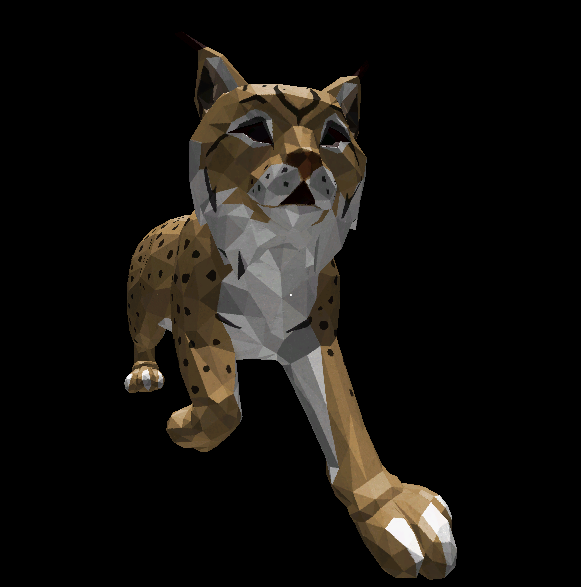

# 3DFX.js 🎮

> A simple realtime 3D engine that rasters triangles directly onto your screen in the web.

**Demo**: [Try it out here!](https://ridhwan-mohamed.github.io/3DFX.js/)

---

## 🌟 Features

### Pure HTML Canvas
Runs purely on HTML canvas without the need for any external graphics libraries or gpu api's.
### Clipping
Efficiently trims objects to improve rendering performance.
### Flat Shading
Provides a solid color rendering for each polygon, enhancing the visual output.
### UV Texturing
Maps 2D textures onto 3D objects for realistic rendering.
### Z Buffer
Implements depth buffering to handle overlapping objects and maintain correct visibility.
### 3MF File Parser
Capable of reading and interpreting 3MF file formats for 3D graphics.
### Backface Culling
Optimizes rendering by eliminating polygons facing away from the viewer.

---

## 🖼️ Screenshots
# All 3D models and textures used for displaying are from Paint 3D's '3D library'. 

<!-- Add more images as needed -->

---

## 📜 License
This project is licensed under the MIT License.
